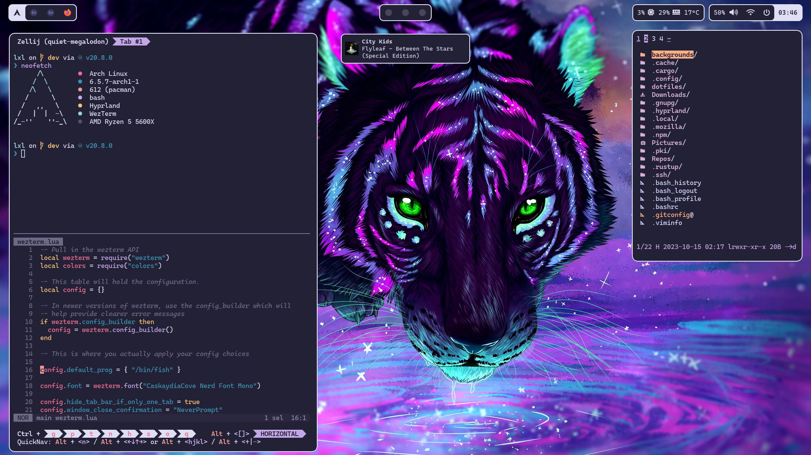
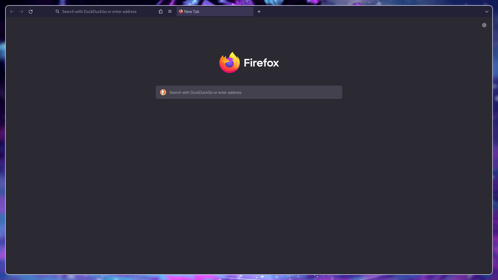
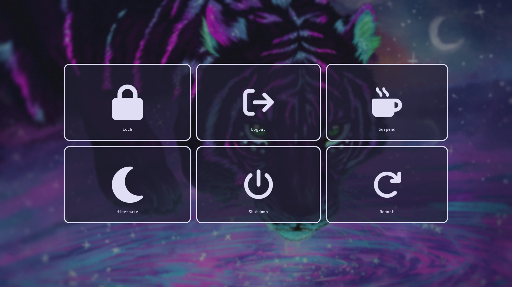

# dotfiles

### Things I use

|                    | Packages                                                                     |
| ------------------ | ---------------------------------------------------------------------------- |
| OS                 | [Arch](https://archlinux.org/)                                               |
| DM                 | [Ly](https://github.com/fairyglade/ly)                                       |
| WM/Compositor      | [Hyprland](https://hyprland.org/)                                            |
| Shell              | [Bash](https://www.gnu.org/software/bash/) / [Fish](https://fishshell.com/)  |
| Prompt             | [Starship](https://starship.rs/)                                             |
| Terminal           | [Wezterm](https://wezfurlong.org/wezterm/)                                   |
| Terminal Workspace | [Zellij](https://zellij.dev/)                                                |
| Editor             | [LazyVim](https://www.lazyvim.org/) / [Helix](https://helix-editor.com/)     |
| File manager       | [Nnn](https://github.com/jarun/nnn)                                          |
| Bar                | [Waybar](https://github.com/Alexays/Waybar)                                  |
| Notifications      | [Dunst](https://github.com/dunst-project/dunst)                              |
| Launcher           | [Wofi](https://hg.sr.ht/~scoopta/wofi)                                       |
| Theme Manager      | [Flavours](https://github.com/Misterio77/flavours)                           |
| Wallpaper Manager  | [Swww](https://github.com/Horus645/swww)                                     |
| Lockscreen         | [Swaylock Effects](https://github.com/mortie/swaylock-effects)               |
| Idle manager       | [Swayidle](https://github.com/swaywm/swayidle)                               |
| Logout Menu        | [Wlogout](https://github.com/ArtsyMacaw/wlogout)                             |
| Font               | [Caskaydia Cove Nerd font](https://www.nerdfonts.com/font-downloads)         |
| Icons              | [Tela Circle](https://github.com/vinceliuice/Tela-circle-icon-theme)         |
| Audio              | [Easy Effects](https://github.com/wwmm/easyeffects)                          |
| Browser            | [Firefox](https://mozilla.org/)                                              |
| Firefox CSS        | [Cascade](https://github.com/andreasgrafen/cascade/)                         |
| Input Remapper     | [Evremap](https://github.com/wez/evremap)                                    |
| Git Terminal GUI   | [Lazygit](https://github.com/jesseduffield/lazygit)                          |
| Node Managers      | [Fnm](https://github.com/Schniz/fnm) / [Pnpm](https://github.com/Schniz/fnm) |

### Some images

### Credits/Inspiration

- [Misterio77](https://github.com/Misterio77)
- [Stephan Raabe](https://gitlab.com/stephan-raabe)
