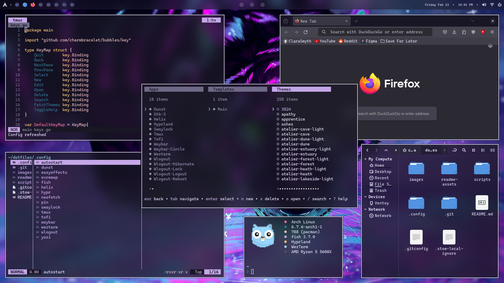
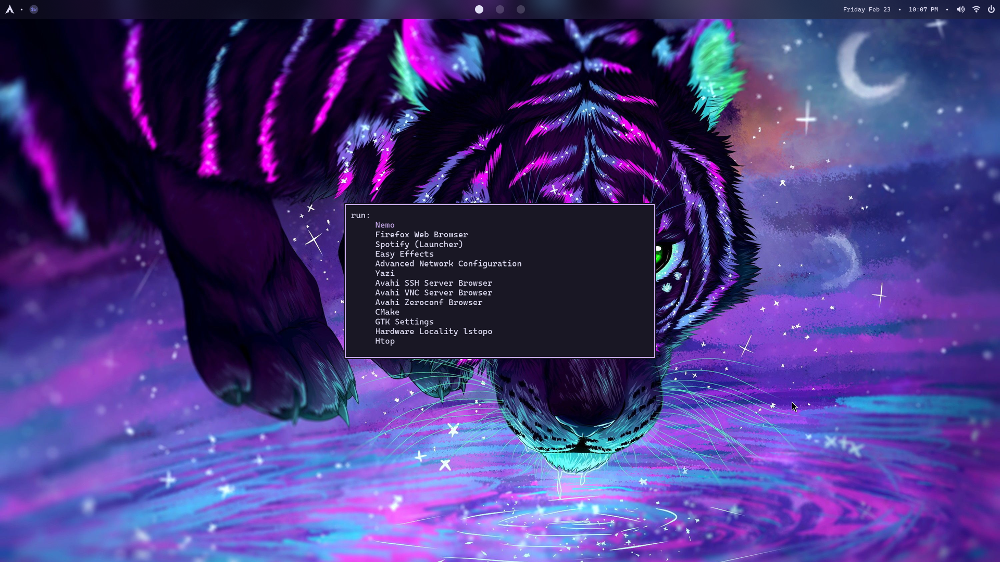
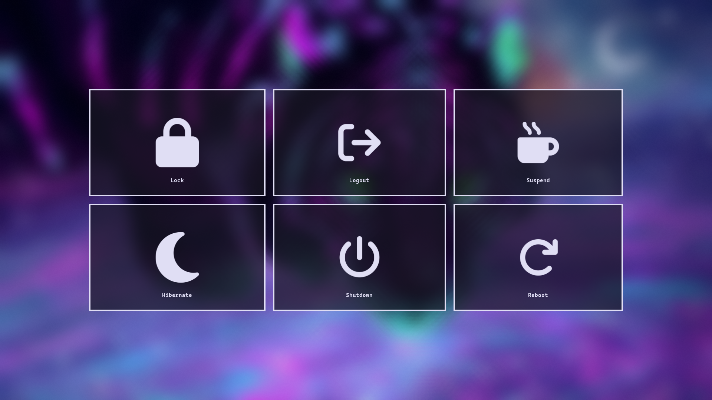
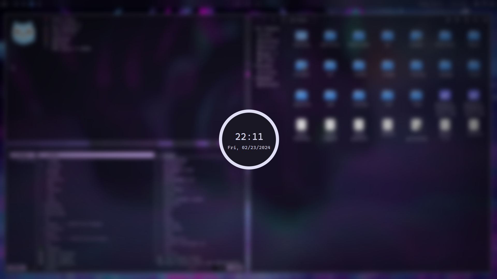
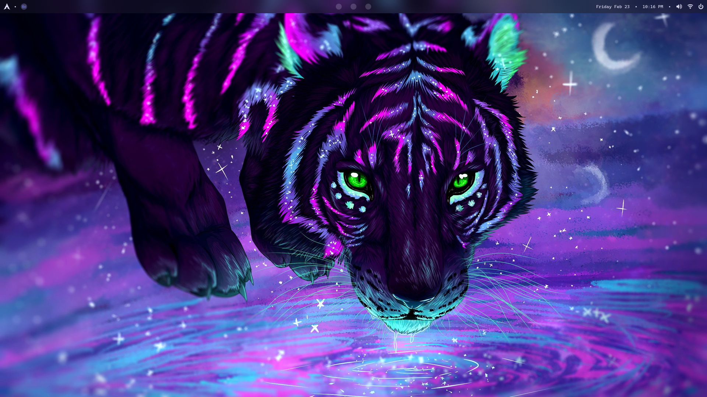

# dotfiles

### Things I use

|                   | Packages                                                                           |
| ----------------- | ---------------------------------------------------------------------------------- |
| OS                | [Arch](https://archlinux.org/)                                                     |
| DM                | [Ly](https://github.com/fairyglade/ly)                                             |
| WM/Compositor     | [Hyprland](https://hyprland.org/)                                                  |
| Shell             | [Fish](https://fishshell.com/)                                                     |
| Prompt            | [Starship](https://starship.rs/)                                                   |
| Terminal          | [Wezterm](https://wezfurlong.org/wezterm/)                                         |
| Multiplexer       | [Tmux](https://github.com/tmux/tmux)                                               |
| Theme Manager     | [Pin](https://github.com/ClaraSmyth/pin)                                           |
| Editor            | [Helix](https://helix-editor.com/)                                                 |
| File Manager      | [Yazi](https://github.com/sxyazi/yazi) / [Nemo](https://github.com/linuxmint/nemo) |
| Bar               | [Waybar](https://github.com/Alexays/Waybar)                                        |
| Notifications     | [Dunst](https://github.com/dunst-project/dunst)                                    |
| Launcher          | [Tofi](https://github.com/philj56/tofi)                                            |
| Wallpaper Manager | [Swww](https://github.com/Horus645/swww)                                           |
| Lockscreen        | [Swaylock Effects](https://github.com/mortie/swaylock-effects)                     |
| Idle manager      | [Swayidle](https://github.com/swaywm/swayidle)                                     |
| Logout Menu       | [Wlogout](https://github.com/ArtsyMacaw/wlogout)                                   |
| Font              | [Caskaydia Cove Nerd font](https://www.nerdfonts.com/font-downloads)               |
| Icons             | [Tela Circle](https://github.com/vinceliuice/Tela-circle-icon-theme)               |
| Audio             | [Easy Effects](https://github.com/wwmm/easyeffects)                                |
| Browser           | [Firefox](https://mozilla.org/)                                                    |
| Input Remapper    | [Evremap](https://github.com/wez/evremap)                                          |
| Git Terminal GUI  | [Lazygit](https://github.com/jesseduffield/lazygit)                                |
| Node Manager      | [Pnpm](https://pnpm.io/)                                                           |

### Some Images

